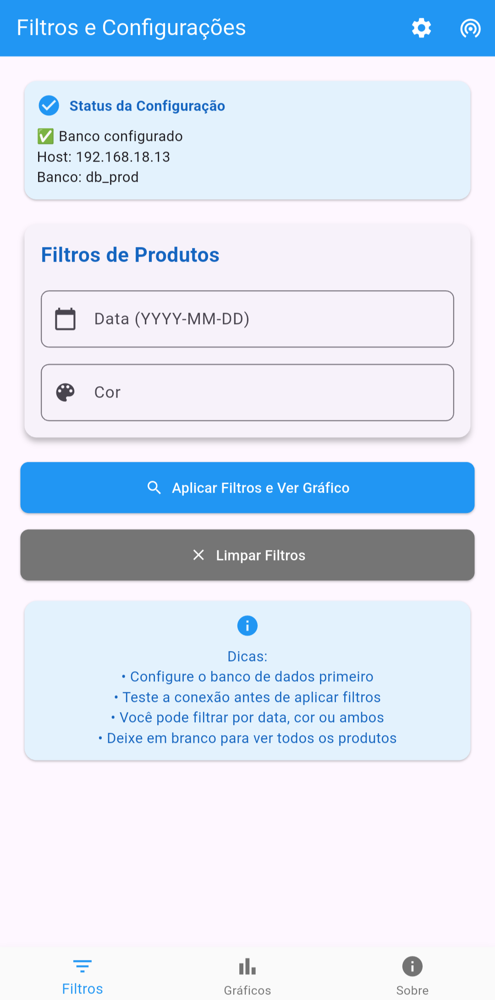
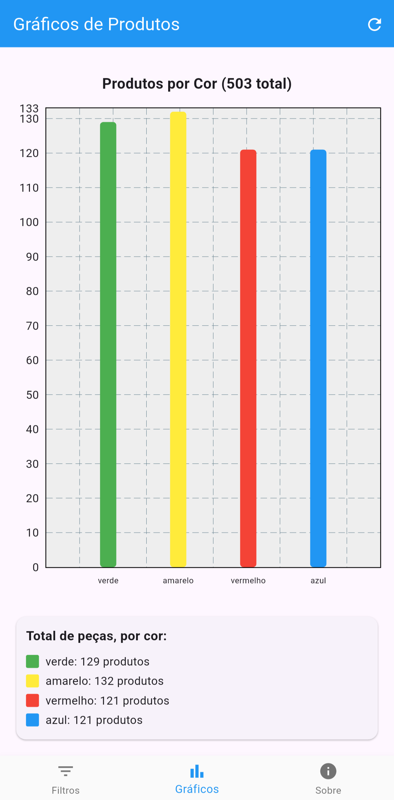

# 📊 Gráficos de Produtos - Flutter App

Um aplicativo Flutter para visualização de dados de produção em tempo real, conectando diretamente com banco de dados MySQL para exibir gráficos e estatísticas de peças produzidas.


## ✨ Funcionalidades

- 🗄️ **Conexão MySQL Configurável**: Configure dinamicamente a conexão com diferentes bancos de dados
- ⚙️ **Interface de Configuração**: Formulário integrado para configurar host, porta, usuário, senha e banco
- 📊 **Gráficos de Barras**: Visualização clara dos dados de produção por cor
- 🔍 **Filtros Inteligentes**: Filtre dados por data e/ou cor das peças
- 🔧 **Teste de Conexão**: Verifique a conectividade com o banco antes de usar
- 📱 **Interface Responsiva**: Design moderno e intuitivo
- 🔄 **Atualização em Tempo Real**: Dados sempre atualizados

## 🏗️ Estrutura do Banco de Dados

O aplicativo espera as seguintes tabelas no MySQL:

```sql
-- Tabela de produtos
CREATE TABLE tb_prod (
    id_prod INT PRIMARY KEY AUTO_INCREMENT,
    cor INT,
    material INT,
    tamanho INT,
    data_hora DATETIME
);

-- Tabela de cores
CREATE TABLE tb_cor (
    id_cor INT PRIMARY KEY AUTO_INCREMENT,
    cor VARCHAR(50)
);

-- Tabela de materiais
CREATE TABLE tb_material (
    id_material INT PRIMARY KEY AUTO_INCREMENT,
    material VARCHAR(50)
);

-- Tabela de tamanhos
CREATE TABLE tb_tamanho (
    id_tamanho INT PRIMARY KEY AUTO_INCREMENT,
    tamanho VARCHAR(50)
);
```

## 🚀 Como Usar

### Pré-requisitos

- Flutter SDK (versão 3.0+)
- Dart SDK
- Servidor MySQL rodando
- Banco de dados configurado com as tabelas necessárias

### Instalação

1. **Clone o repositório**
   ```bash
   git clone https://github.com/seu-usuario/graficos-produtos-flutter.git
   cd graficos-produtos-flutter
   ```

2. **Instale as dependências**
   ```bash
   flutter pub get
   ```

3. **Execute o aplicativo**
   ```bash
   flutter run
   ```

### Configuração

1. **Abra o aplicativo** e vá para a aba "Filtros"

2. **Configure o banco de dados**:
   - Toque no ícone de configurações (⚙️) no AppBar
   - Preencha os dados de conexão:
     - **Host/IP**: Endereço do servidor MySQL
     - **Porta**: Geralmente 3306
     - **Usuário**: Usuário do MySQL
     - **Senha**: Senha do usuário
     - **Nome do Banco**: Nome do banco de dados
   - Toque em "Aplicar Configuração"

3. **Teste a conexão**:
   - Toque no ícone de teste (📡) no AppBar
   - Verifique se a conexão foi estabelecida com sucesso

4. **Aplique filtros** (opcional):
   - Data: formato YYYY-MM-DD (ex: 2024-01-15)
   - Cor: nome da cor (ex: Azul, Vermelho)

5. **Visualize os gráficos**:
   - Toque em "Aplicar Filtros e Ver Gráfico"
   - Navegue para a aba "Gráficos" para ver os resultados

## 📦 Dependências

```yaml
dependencies:
  flutter:
    sdk: flutter
  mysql1: ^0.20.0  # Conexão MySQL
  fl_chart: ^0.68.0  # Gráficos
```

## 🎯 Como Contribuir

1. Fork o projeto
2. Crie uma branch para sua feature (`git checkout -b feature/AmazingFeature`)
3. Commit suas mudanças (`git commit -m 'Add: AmazingFeature'`)
4. Push para a branch (`git push origin feature/AmazingFeature`)
5. Abra um Pull Request

## 📱 Screenshots

### Tela de Configuração


### Tela de Filtros


### Tela de Gráficos


## ⚙️ Configurações de Rede

### Para desenvolvimento local:
- Host: `localhost` ou `127.0.0.1`
- Porta: `3306`

### Para rede local:
- Host: IP do servidor na rede (ex: `192.168.1.100`)
- Porta: `3306`

### Para produção:
- Configure seu servidor MySQL para aceitar conexões externas
- Use SSL/TLS para conexões seguras
- Configure firewall apropriadamente

## 🔒 Segurança

⚠️ **Importante**: Este aplicativo foi desenvolvido para uso em ambiente controlado. Para produção:

- Use conexões SSL/TLS
- Implemente autenticação robusta
- Configure usuários MySQL com permissões mínimas necessárias
- Use variáveis de ambiente para credenciais sensíveis

## 🐛 Solução de Problemas

### Erro de Conexão
- Verifique se o MySQL está rodando
- Confirme se as credenciais estão corretas
- Verifique se o firewall permite conexões na porta 3306
- Teste a conectividade com ferramentas como MySQL Workbench

### Dados não aparecem
- Verifique se as tabelas existem no banco
- Confirme se há dados nas tabelas
- Teste as queries SQL diretamente no MySQL

### Problemas de Performance
- Considere adicionar índices nas tabelas
- Otimize as queries SQL
- Limite a quantidade de dados retornados

## 👥 Autores

- **Lucas Soares Pevarello** - Desenvolvimento principal
- **Marcelo Soares Pevarello** - Auxilio no desenvolvimento, ~~apoio mental~~

### Orientação Acadêmica
- **Prof. Alex Pisciotta** - Desenvolvimento do PLC e conjunto de esteira
- **Prof. Márcio Nagy**  - Aulas de desenvolvimento mobile
- **Prof. Orlando Rosa Junior** - Auxilio na configuração do banco de dados

**Faculdade de Tecnologia SENAI Félix Guisard**

## 📄 Licença

Este projeto está licenciado sob a Licença MIT - veja o arquivo [LICENSE](LICENSE) para detalhes.

## 🤝 Agradecimentos

- Faculdade de Tecnologia SENAI Félix Guisard
- Professores orientadores
- [Tutorial de como usar BarChart do Fl_chart](https://youtu.be/vYe0RY1nCAA?si=Exnw42JyHyeZDXxR)

---

⭐ **Se este projeto foi útil para você, considere deixar uma estrela!**